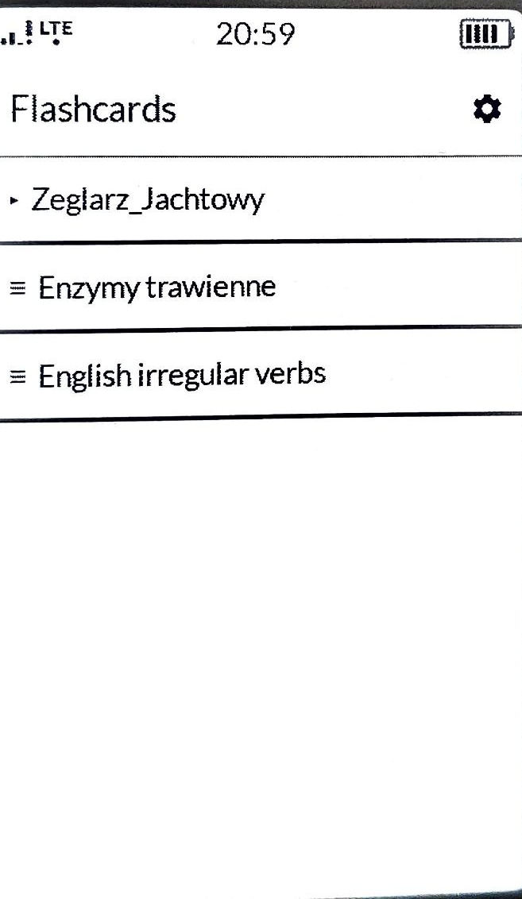
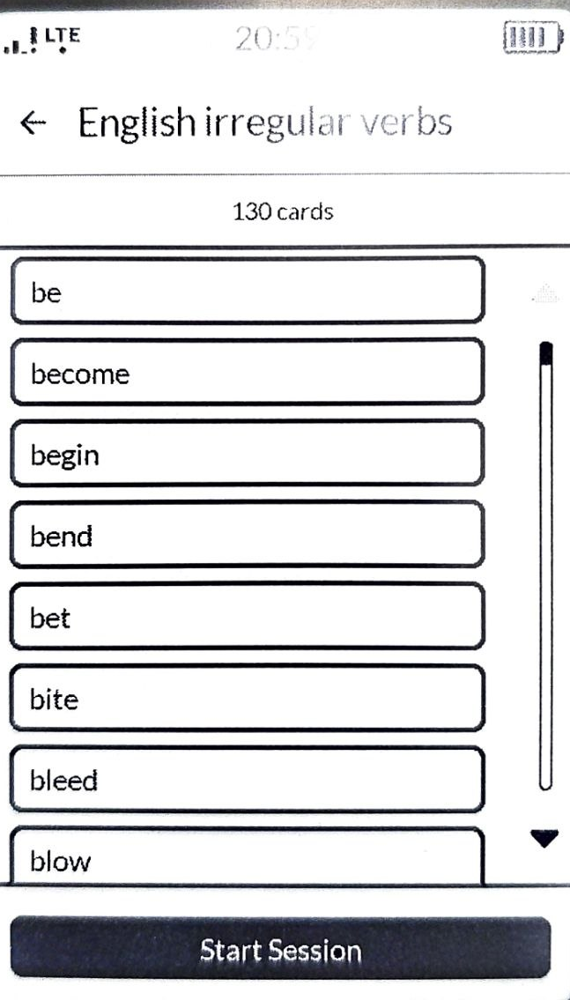
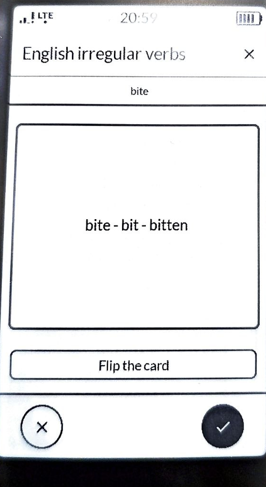
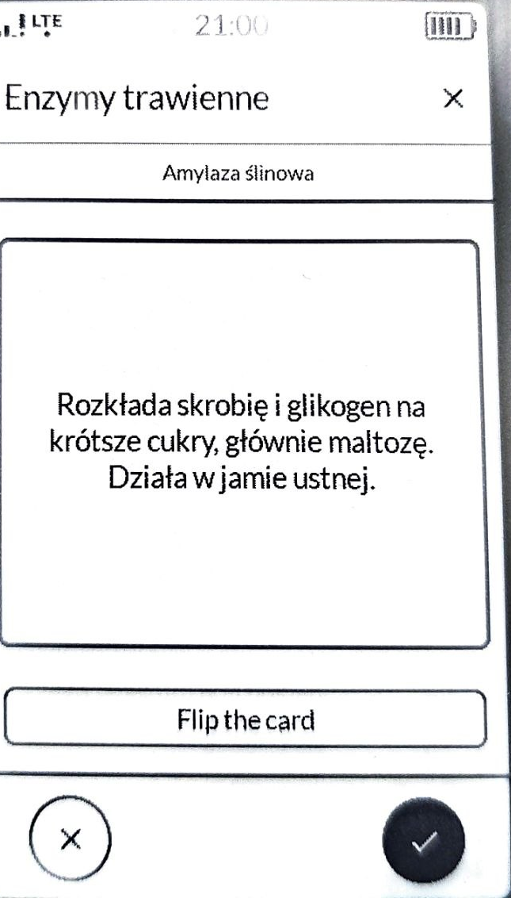
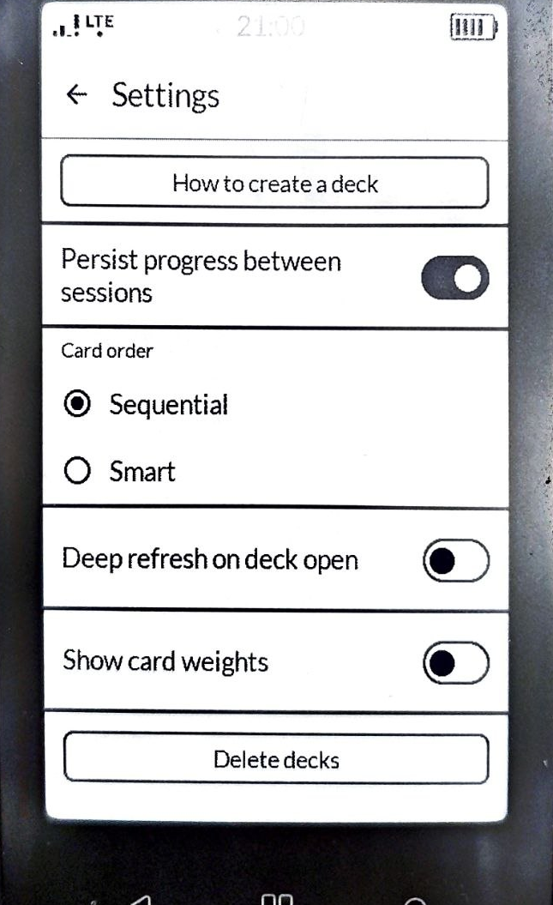
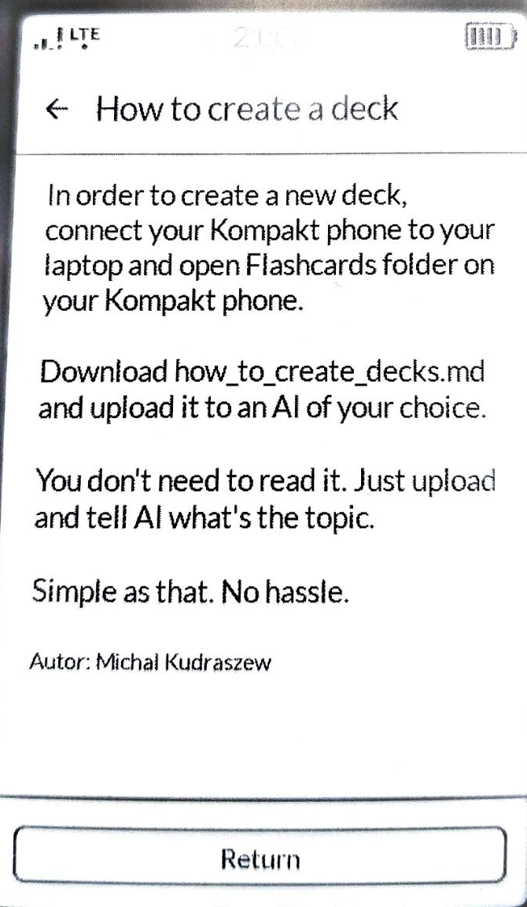

# Mudita Flashcards


A calm, deliberate flashcards app for the [Mudita Kompakt](https://mudita.com/products/phones/mudita-kompakt/), an E Ink phone designed for digital well-being. Built with the [Mudita Mindful Design (MMD)](https://github.com/mudita/MMD) framework as an entry to the **Mudita Mindful App Design Challenge** (May to June 2026), Track A — new application.

> Spokojna nauka bez presji. *Calm learning, no pressure.*

---

## Table of contents

- [Download and install](#download-and-install)
- [Quick start for reviewers](#quick-start-for-reviewers)
- [Project Overview](#project-overview)
  - [1. The problem we are answering](#1-the-problem-we-are-answering)
  - [2. Mindful angle: "calm learning, no pressure"](#2-mindful-angle--calm-learning-no-pressure)
  - [3. Bright Patterns: what we deliberately do not include, and why](#3-bright-patterns--what-we-deliberately-do-not-include-and-why)
  - [4. Architecture and technical implementation](#4-architecture-and-technical-implementation)
  - [5. E Ink design decisions](#5-e-ink-design-decisions)
  - [6. Screens](#6-screens)
  - [7. Creating decks](#7-creating-decks)
- [Using the app](#using-the-app)
- [Building from source](#building-from-source)
- [Notes for developers](#notes-for-developers)
- [Screenshots](#screenshots)
- [How design decisions map to the judging criteria](#how-design-decisions-map-to-the-judging-criteria)
- [Status](#status)
- [Future scope](#future-scope)
- [Acknowledgements](#acknowledgements)
- [Licence](#licence)

---

## Download and install

A pre-built APK is attached to every [GitHub Release](https://github.com/Mickud76ai/mudita-flashcards/releases). The current release for the Mudita Mindful App Design Challenge is **[v1.0.1](https://github.com/Mickud76ai/mudita-flashcards/releases/tag/v1.0.1)**; download `mudita-flashcards-1.0-debug.apk` from the *Assets* section.

To install on a Mudita Kompakt:

- **Easiest** — open [Mudita Center](https://mudita.com/products/software-apps/mudita-center/), connect Kompakt via USB-C, drag the APK onto the app.
- **Alternative** — open [WebADB](https://app.webadb.com/) in Chrome, connect Kompakt via USB-C (developer options + USB debugging enabled), use *Install APK*.
- **For developers** — `adb install mudita-flashcards-1.0-debug.apk`.

If you would rather build from source, see [Building from source](#building-from-source).

---

## Quick start for reviewers

For jury members and anyone evaluating the app:

1. Download `mudita-flashcards-1.0-debug.apk` from [Releases](https://github.com/Mickud76ai/mudita-flashcards/releases/tag/v1.0.1) and sideload onto a Mudita Kompakt via Mudita Center or WebADB (see [Download and install](#download-and-install) for the full instructions).
2. Open the app, tap *Open settings* on the permission screen, grant *All files access*, return to the app.
3. The app installs starter decks on first launch: Polish sailing terminology (folder `Zeglarz_Jachtowy/`), English irregular verbs and phrasal verbs (folder `Angielski/`), digestive enzymes. Tap into a folder, pick a deck (for example *English Irregular Verbs*), then tap *Start Session*.
4. The session has no end. Leave whenever you choose, with the × in the top bar.

That is the complete first-run sequence, intentionally short. Everything else, persistence, sort modes, deep refresh, lives in Settings and is off by default.

---

## Project Overview

### 1. The problem we are answering

Popular flashcard apps — Anki, Duolingo, Quizlet — are engineered to maximise engagement. They surround a simple act of learning with timers, streaks, points, badges, and notifications. These mechanics are well-documented Dark Patterns: they harvest attention and replace intrinsic motivation with anxiety about losing what the app has given you.

On a phone that was deliberately built to give attention back, those mechanics are not just unwelcome — they are antithetical to the device. Mudita Flashcards is a small answer to one specific question: *what does a flashcards app look like when it serves the user, not the other way around?*

### 2. Mindful angle — "calm learning, no pressure"

The app has no opinion on how much you should study today. It does not measure how long you spend on a card. It does not reward streaks. It does not notify. You open it when you decide to; you close it when you decide to. Stopping on a hard card is fine — that is part of learning, not a failure.

The paradigm is *notebook, not game*.

### 3. Bright Patterns — what we deliberately do not include, and why

| Dark Pattern (where it lives) | Why we reject it | What we do instead |
|---|---|---|
| Timer on each card (Duolingo, Quizlet) | Time pressure converts learning into a race and harms long-term retention | No timer, anywhere, ever |
| Streaks (Duolingo, Anki) | Punishes any break — sickness, travel, a busy week — and replaces motivation with fear of losing points | The app does not remember when it was last opened |
| Points, ranks, badges (Quizlet, Duolingo) | Builds external motivation that collapses when rewards stop being enough | Knowledge is the only reward; we offer no substitutes |
| Push notifications (Anki, Duolingo) | Interrupts focus, manufactures obligation toward the app | No notifications; the app has no notification channels |
| "You have 47 cards overdue" (Anki) | Cognitive debt that demotivates after any absence | No persistent SRS state — each session starts fresh |
| Progress bar within a session (Quizlet) | Pressure to finish; endowment effect | No progress bar, no "X of Y cards" counter |
| Card-flip animations (Quizlet) | Causes ghosting on E Ink and is gratuitous decoration | Instant content swap, no animations of any kind |
| Snackbar / popup after a correct answer (Duolingo) | Sudden interruption, infantilising of learning | Silence after every answer |
| Real-time statistics (Anki) | Pulls attention from content to metrics | No live statistics |
| Recommended decks (Quizlet) | Directs the user's attention to content the app wants them to see | The deck list is exactly your folder of CSV files, nothing more |

A few patterns we *do* embrace, because they shift power toward the user:

- **Sessions have no end.** You leave when you choose to. There is no "you completed the deck" screen.
- **The algorithm is silent by default.** Weighted random sampling biases toward less-seen and "hard"-marked cards, but no weights or counts are shown — the work is invisible. (You can opt in to see the weights with a single toggle, if it helps your learning.)
- **"Still learning" is a navigation tool, not a verdict.** Marking a card as hard biases sampling within this session only by default; it is forgotten when you leave, unless you opt in to persistence.
- **You own the content.** Decks are CSV files on your phone. You create them on a computer, with AI or by hand, and copy them over USB-C. The app is a reader, not an editor or a curator.
- **Self-healing help.** `how_to_create_decks.md` is restored to its original contents on every launch — you cannot accidentally lock yourself out of the help by deleting it.
- **Grade-before-flip is allowed.** Both the "Still learning" (✗) and "Know" (✓) buttons are always visible — you can mark a card without flipping it if you already know the answer.
- **The deck preview is non-interactive on purpose.** When opening a deck you see the list of card fronts, but rows are not tappable — the only way into a card is *Start Session*. An earlier iteration let you tap a row to peek at the back; user testing showed people would browse cards one by one and never start a session, missing the point of the app. Removing the tap target is a small loss of flexibility, a large gain in clarity.
- **User autonomy through Settings.** Three behaviours — persistence between sessions, card order (Sequential / Smart), and deep-refresh flash on screen transitions — are explicit user choices. Default off for all (mindful default), opt in when meaningful. No "Recommended" badges, no nagging.
- **Destructive actions require explicit confirmation.** Deleting a deck and disabling progress persistence both route to a full-screen confirm with a Cancel button. No modal dialog flashes; the choice is given the whole screen.

### 4. Architecture and technical implementation

- **Language and stack.** Kotlin, Jetpack Compose, single-Activity, no ViewModel, no Room, no DI. MMD 1.0.1 from Maven Central. JVM 17. Compose plugin 2.x. `minSdk = 31` (MuditaOS K = AOSP 12 = API 31), `targetSdk = 36`, `compileSdk = 36`.
- **UI framework.** Every visible UI element is a Mudita Mindful Design component (`ThemeMMD`, `TopAppBarMMD`, `TextMMD`, `ButtonMMD`, `OutlinedButtonMMD`, `HorizontalDividerMMD`, `LazyColumnMMD`). Only layout primitives (`Scaffold`, `Box`, `Column`, `Row`, `Spacer`) and the `IconButton`/`Icon` slots inside `TopAppBarMMD` use raw Material 3 — exactly as the MMD documentation itself does.
- **Colours.** `MaterialTheme.colorScheme` only, i.e. pure black (`#000000`) and pure white (`#FFFFFF`). No greys. No alpha for "subtlety". Hierarchy is communicated through font size, not colour.
- **Typography.** `MaterialTheme.typography` only — Lato Medium across the board. No raw `fontSize`.
- **Storage.** Decks are CSV files at `/storage/emulated/0/Flashcards/` (top-level Internal Shared Storage, sitting next to `Documents`, `Music`, `Pictures` etc.). The app requests `MANAGE_EXTERNAL_STORAGE` once on first launch; after that, you copy CSV files in and out through Windows Explorer (or Android File Transfer / mtpfs on macOS / Linux) over USB-C. No proprietary tool, no Mudita Center step. Decks survive uninstall.
- **Three storage layers, no SQL.** No Room, no SQLite. Session state lives in RAM. App settings live in `DataStore<Preferences>` (`flashcards_settings`). Optional per-card progress, when the user opts in, lives in plain JSON files at `context.filesDir/progress/<sha1>.json` (one per deck), serialised with `kotlinx-serialization-json`.
- **CSV format.** Line 1 is the deck name; line 2 onward is `front;back`. Semicolons are reserved as the separator. UTF-8, optional BOM. Long sides (over 80 / 300 characters) are truncated with a visible `…` rather than rejected, so the user sees the signal without losing the card.
- **Weighted random sampling (Smart mode).** `weight = 1 / (timesShown + 1) × (2.0 if marked hard, else 1.0)`. Never-seen cards get the highest priority; hard cards get double weight against equally-shown easy cards; the last-shown card is excluded from the next pick to prevent immediate repetition. A second mode — Sequential (CSV order) — is also available in Settings.
- **Immutable session state.** `SessionState` is a `data class` mutated only through `.copy()`. Per-card session state (`timesShown`, `isHard`) lives in a `Map<Int, CardSessionMeta>` keyed by index — `FlashCard` itself is pure content from disk. Compose recomposition is predictable because every change replaces the whole state.
- **Card-content hash as progress key.** When persistence is enabled, each card's progress is keyed by SHA-1 of `front + " " + back`. Reordering cards in the CSV preserves history; editing a card's content gives that card a fresh start (the old entry becomes orphaned, which is fine).
- **Self-healing managed asset.** `how_to_create_decks.md` is bundled as an Android asset. On every app launch and every return to the root folder, the app compares the SHA-256 hash of the file on disk with the bundled original and rewrites it if it has been deleted, edited or corrupted. The user's own decks are never touched. (Legacy `template.csv` and `instructions.md` from earlier versions are removed once, gated by a sentinel in internal storage.)
- **Bundled starter decks.** A small set of starter decks (Polish sailing terminology, English irregular verbs, digestive enzymes) is bundled in `assets/default_decks/` and copied to `Flashcards/` once, on first permission grant. A versioned sentinel (`.defaults_installed_v1`) prevents re-installation after the user deletes them. They serve a dual purpose: they give a jury (or any new user) something to test the app with immediately, and they are a working example of correctly-formatted CSV files.
- **On-resume rescan.** When the app returns to the foreground (after the user has uploaded files via USB), the deck list is rescanned automatically.

### 5. E Ink design decisions

- **Portrait, 480 × 800.** MuditaOS K renders applications in portrait by default; the 800 × 480 panel is rotated. The activity is locked to `portrait`.
- **Static layouts, no animations.** The only motion in the app is the optional *deep refresh flash* — a brief full-screen black/white sequence (~360 ms) used to clear ghosting at significant transitions (entering a deck, starting a session). The flash is off by default and gated by a single toggle in Settings, so the app is also fully usable without any motion at all. There is no `animate*`, no `Crossfade`, no `AnimatedVisibility`.
- **Slot-based layout for the session screen.** S3 (front) and S4 (back) are one composable with five fixed-height slots: top bar, echo of the front, card content (the only `weight(1f)` zone), the flip control, and the bottom bar. The card content's pixel position never shifts when you flip. On E Ink this is the difference between a clean transition and a smudge of ghosting in the centre of the screen.
- **Buttons always present.** "Still learning" (✗) and "Know" (✓) are pinned in the `Scaffold` bottom bar across both states of the session screen — you can grade a card without ever flipping it. "Flip the card" is visible on both states too (toggles direction).
- **Step-scrolled lists.** `LazyColumnMMD` provides discrete-step scrolling instead of continuous panning, which is what E Ink wants.
- **Visible controls, with optional shortcuts.** The MMD guidance is explicit: gestures must be supported by visible controls. The full-width `OutlinedButtonMMD` labelled "Flip the card" is always the primary way to flip. Tap on the card body is a *secondary* shortcut familiar from Quizlet and Anki — the visible button still defines the affordance.
- **No reliance on colour or alpha.** Front-of-card "echo" on the back-of-card screen is rendered smaller (`bodySmall`, 15sp) rather than dimmed.
- **Settings access from anywhere.** The gear icon (⚙) in the root `TopAppBarMMD` reaches Settings in one tap, including when the deck list is empty. No deep menus.

### 6. Screens

Ten screens in total:

| ID | Name | Purpose |
|---|---|---|
| S1 | Browser | Current folder's contents — sub-folders prefixed `▸`, decks prefixed `≡`. Gear icon (⚙) opens Settings. |
| S2 | Deck preview | Deck name, card count, scrollable list of card fronts as small MMD cards (non-interactive — see the design notes), pinned "Start Session". Optional weight strip under each card when "Show card weights" is on. Optional mastery-aware sort when Smart + Persist are both on. |
| S3/S4 | Card session | Single composable with `isFlipped`, slot-based, fixed-position grade buttons. The card body is wrapped in `CardMMD`; "Flip the card" sits below the card as a separate action. Tap on the card body is also a flip shortcut. |
| S5 | Empty / error | Variants A (no decks), B (empty folder), C (broken CSV), D (zero cards), E (storage unavailable) |
| S6 | Settings | "How to create a deck" entry, persistence toggle, card-order radio (Sequential / Smart), deep-refresh toggle, show-card-weights toggle, "Delete decks" entry point |
| S7 | Delete decks | Navigable folder view: drill into folders, trash icon on every row deletes a single deck or a whole folder (recursive) |
| S8 | Delete confirm | Full-screen confirmation before deleting a deck or folder (Cancel / Delete). For folders, body shows deck count and, when persistence is on, a note that saved progress will be cleared |
| S10 | Persist disable confirm | Full-screen confirmation before turning persistence off (Cancel / Disable), because disabling wipes all progress and resets all weights to 1.00. |
| — | Permission | One-time prompt to grant `MANAGE_EXTERNAL_STORAGE` so the Flashcards folder can live at the top level of internal storage |

### 7. Creating decks

Decks are CSV files. The first line is the deck name; subsequent lines are `front;back`. Place them anywhere inside the `Flashcards` folder — sub-folders to arbitrary depth become the navigation tree in the app.

Example: `chinese_basics.csv`

```
Chinese, Basics
你好;Hello (Ni hao)
谢谢;Thank you (Xiexie)
再见;Goodbye (Zaijian)
```

Full guidelines, including the recommended AI-assisted workflow (paste `how_to_create_decks.md` into ChatGPT or Claude and ask for a deck on a topic), are bundled with the app as `how_to_create_decks.md` and restored on every launch.

---

## Using the app

### First launch

1. Install the APK. Open the app — the first screen asks you to grant **All files access**. Tap *Open settings*, enable the toggle, return to the app.
2. The app creates `/storage/emulated/0/Flashcards/` and copies into it:
   - `how_to_create_decks.md` (the help, self-healing on every launch)
   - A few starter decks (`Zeglarz_Jachtowy/sailing_*.csv`, `Angielski/english_irregular_verbs.csv`, `Angielski/phrasal_verbs_50.csv`, `digestive_enzymes.csv`)
3. The home screen (S1) shows the decks. Foldery (`▸`) sit above plików (`≡`). Tap a folder to drill in, the back arrow to come up.

### Opening a deck

Tap a deck (`≡`) to open its preview (S2). You see the deck name, the card count, and a list of card fronts shown as small cards. The list is **non-interactive on purpose** — see the design notes for why. The only way into a card is *Start Session*.

Tap **Start Session** (S3/S4). Front of the card is shown. Three actions:

- **Tap "Flip the card"** or **tap the card body** — flips between front and back.
- **Tap ○✗ "Still learning"** — records the card as hard (boosts it in Smart mode) and shows the next card.
- **Tap ○✓ "Know"** — records the card as known and shows the next card.

The session has no end. Leave whenever you want with **×** in the top bar, the back arrow, or the system back button.

### Adding your own decks

1. Connect the Kompakt to a computer with a USB-C cable.
2. Open *Internal shared storage* → `Flashcards` in Windows Explorer (or Android File Transfer / mtpfs on macOS / Linux).
3. Copy `.csv` files in. Sub-folders to any depth become the navigation tree in the app. The format is described in `how_to_create_decks.md` (a file the app keeps in that same folder).
4. Switch back to the app — the list refreshes automatically.

### Settings (S6)

Open with the gear icon (⚙) on the home screen.

- **Persist progress between sessions** — *off* by default. When on, each ○✗ / ○✓ rating is saved to internal app storage; the next session resumes from the saved state. Turning this off again opens a confirmation screen, because it wipes all saved progress and returns every card to weight 1.00.
- **Card order** — *Smart* by default. Two options:
  - **Sequential** — cards in CSV order, wrapping around.
  - **Smart** — weighted random favouring cards you haven't seen and cards you marked ○✗.
- **Deep refresh on deck open** — *off* by default. When on, a brief full-screen black/white sequence runs before opening a deck preview and starting a session. Helps clear E Ink ghosting; cost is one extra ~360 ms transition. See [Notes for developers](#notes-for-developers) for why this is implemented as a manual screen wipe rather than calling the system's gamma-mode refresh.
- **Show card weights on deck preview** — *off* by default. When on, a small `shown N× · hard/ok · w=0.XX` line appears under each card on the preview list. Useful when you want to see the algorithm at work; off otherwise.
- **Delete decks** — opens a navigable view of the `Flashcards/` folder. Each row has a trash icon. Tapping a folder name drills into it (the trash still sits on the row to delete the whole folder); tapping a deck row's trash deletes that one deck. Every deletion — empty folder, non-empty folder, single deck — routes to a full-screen confirmation with Cancel / Delete. Deleting a folder removes everything inside it recursively and clears any saved progress for the decks that lived there.

### Storage layout on the device

```
/storage/emulated/0/Flashcards/        — visible in Windows Explorer
├── how_to_create_decks.md             — self-healing, always present
├── Angielski/                         — bundled starter
│   ├── english_irregular_verbs.csv
│   └── phrasal_verbs_50.csv
├── Zeglarz_Jachtowy/                  — bundled starter
│   ├── sailing_meteorology.csv
│   ├── sailing_rules.csv
│   └── sailing_yacht_parts.csv
├── digestive_enzymes.csv              — bundled starter
└── … your own decks here …            — copy via USB

/data/data/com.kompakt.flashcards/files/          — internal, invisible to Explorer
├── .defaults_installed_v2             — sentinel: starter decks installed
└── progress/                          — only if "Persist progress" was ever on
    └── <sha1-of-deck-path>.json       — one file per deck
```

The user-visible folder survives uninstall; the internal one does not.

---

## Building from source

Prerequisites: Android Studio (Ladybug or newer), JDK 17, Android SDK with API 36.

```bash
git clone https://github.com/Mickud76ai/mudita-flashcards.git
cd mudita-flashcards
./gradlew assembleDebug
```

The debug APK is produced at `app/build/outputs/apk/debug/mudita-flashcards-1.0-debug.apk`. Sideload onto Kompakt via [WebADB](https://app.webadb.com/) or `adb install`.

On Windows, if you run Gradle outside Android Studio, set `JAVA_HOME` to the bundled JBR:

```powershell
$env:JAVA_HOME = "C:\Program Files\Android\Android Studio\jbr"
.\gradlew.bat assembleDebug
```

### First-run setup

1. Install the APK on Kompakt.
2. Open the app — the first screen asks you to grant **All files access**. Tap *Open settings*, enable the toggle, return to the app.
3. The app creates `/storage/emulated/0/Flashcards/` with `how_to_create_decks.md` inside, and displays "No decks found".
4. Connect Kompakt to a computer via USB-C; the Flashcards folder is visible at the top of *Internal shared storage* in Windows Explorer. Copy your CSV decks (and sub-folders) into it.
5. Return to the app — the list refreshes automatically.

---

## Notes for developers

A short list of constraints we ran into while building this app on the Mudita Kompakt, written down for anyone else writing for the platform. Nothing here changes how the app works — it documents *why* certain things are done the way they are.

### E Ink refresh modes are not in the public API

The Kompakt's display driver supports several refresh modes — `slow`, `fast`, `quality`, `gamma`, etc. The Mudita launcher and stock apps switch between them depending on context (e.g. the e-reader uses a slower, ghost-free mode). This is well-documented on `forum.mudita.com/t/e-ink-display-slow-vs-fast-modes/`.

**These modes are not exposed to sideloaded apps.** They are tied to a system service (`Mudita Service`), which only other system apps can call. There is no MMD wrapper, no `Intent`, no broadcast — confirmed by multiple developers on the forum, and verified by inspecting MMD 1.0.1 sources (no refresh API anywhere). A workaround exists (call the system brightness dialog so the OS briefly treats your app as a system app), but it is fragile and ugly, and we did not pursue it.

Our **deep refresh flash** (`DeepRefreshFlash.kt`) is a deliberate alternative: a full-screen black → white sequence drawn from Compose, ~360 ms, which forces the driver to propagate full-screen pixel changes even in fast mode. It uses only the public Compose surface, no reflection, no hidden APIs. The flash is off by default and gated by a Settings toggle; the app remains fully usable without any motion at all.

If Mudita publishes a refresh-mode API in a future MMD release, we will switch to it.

### MMD does not specify a launcher-icon shape

The Mudita launcher does **not mask** application icons — every icon is rendered as-is, including its background. Despite this, MMD 1.0.1 contains **no specification** for icon canvas size, stroke, corner radius or symbol-area ratio. The only authoritative source we found is a forum post by Tomasz Omelan (UX Design Lead, Kompakt) at `forum.mudita.com/t/android-mudita-os-k-app-icon-templates/` (post #10, July 2025), which gives concrete numbers (canvas 81 × 81 px @ mdpi, symbol 40 × 40 px, stroke 2.5 px inside, corner radius 19 px).

This is a real gap. The icon is the first thing a user sees on the launcher, and the only documentation lives in a single forum reply. A future MMD revision should provide an official `IconMMD` or at least a dimensions reference. For this project, we followed the forum spec and tuned the scale empirically (~67–75% of the adaptive-icon viewport).

---

## Screenshots

All screenshots are photographs of a physical Mudita Kompakt (4.3" E Ink, 800×480, portrait), cropped to the screen area.

| | | |
|---|---|---|
|  |  |  |
| Deck browser (S1) | Deck preview (S2) | Session, back — English (S4) |
|  |  |  |
| Session, back — Polish (S4) | Settings (S6) | How to create a deck (from Settings) |

---

## How design decisions map to the judging criteria

| Criterion | Where it lives in this project |
|---|---|
| **1. Bright Patterns integration** | Section 3 of the overview (the Dark → Bright table). Every Settings toggle defaults to *off*. The session has no end screen. There are no notifications, no streaks, no points, no progress bar, no real-time statistics. Destructive actions go through full-screen confirms rather than modal flashes. |
| **2. Creativity** | The slot-based session layout with fixed-position controls (one composable for front and back, zero centre-of-screen ghosting). The AI-first deck creation workflow (the app is a reader, not an editor). The self-healing `how_to_create_decks.md` managed by SHA-256. The deliberately non-interactive deck preview that funnels users into starting a real session rather than browsing card-by-card. |
| **3. Technical implementation** | Section 4. Single Activity, no ViewModel, no Room, no SQL. Every visible UI element is a Mudita Mindful Design component. Pure `MaterialTheme.colorScheme` (black and white only), Lato Medium typography throughout. SHA-1 card hashing keeps progress stable across CSV edits. DataStore Preferences for settings, plain JSON for opt-in progress. |
| **4. E Ink usability and accessibility** | Section 5. Portrait lock, `LazyColumnMMD` step-scrolled lists, no animations, hierarchy through font size not colour or alpha, optional deep-refresh flash at significant transitions, visible controls beside any gesture shortcut. |

---

## Status

All MVP screens are implemented and the app runs on a physical Mudita Kompakt: deck browser, deck preview (with optional mastery sort and weights strip), the slot-based session screen wrapped in `CardMMD`, settings panel, delete-deck flow, persist-disable confirm, permission onboarding. Self-healing assets and the bundled starter decks install on first run.

Tuning likely after more device time: button sizes for thumb comfort, divider density on long lists, the exact slot heights for the session screen, the wording of the empty-state messages.

## Future scope

Out of scope for the MVP but planned for later iterations:

- Full spaced repetition with due dates (SM-2 or Leitner) as a fourth card-order mode
- In-app deck editor for quick edits without a computer
- Import from Anki `.apkg` and Quizlet exports
- Search across decks
- Home-screen widget — a card of the day
- ZIP backup of all decks into `Flashcards/_backup/`

## Acknowledgements

- The [Mudita Mindful Design (MMD)](https://github.com/mudita/MMD) framework, open-sourced by Mudita in 2026, makes this app possible.
- The [Mudita Mindful App Design Challenge](https://mudita.com/community/blog/announcing-the-mudita-mindful-app-design-challenge/) is the reason this project exists.
- The jury of the challenge, Tomasz Omelan, Mateusz Mróz, Harry Oaten, Kinga Skorupska, Dominika Worek and Adam Wierzbicki, for caring about how technology shapes attention.
- [PJATK](https://pja.edu.pl/en/) (Polsko-Japońska Akademia Technik Komputerowych) for co-organising the challenge and contributing the academic perspective on Bright Patterns.
- The community of Kompakt developers on [forum.mudita.com](https://forum.mudita.com), especially the authors of CalmCast, einkMeditation, inkOS, KISS-eink and the many other E Ink-first apps, set the bar for what a sideloaded app on this device can be.

## Licence

[MIT](LICENSE).
